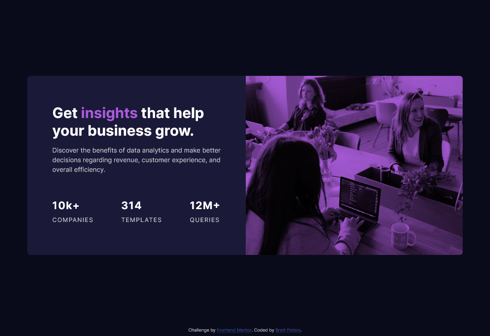

# Frontend Mentor - Stats preview card component solution

This is a solution to the [Stats preview card component challenge on Frontend Mentor](https://www.frontendmentor.io/challenges/stats-preview-card-component-8JqbgoU62). Frontend Mentor challenges help you improve your coding skills by building realistic projects. 

## Table of contents

- [Overview](#overview)
  - [The challenge](#the-challenge)
  - [Screenshot](#screenshot)
  - [Links](#links)
- [My process](#my-process)
  - [Built with](#built-with)
  - [What I learned](#what-i-learned)
  - [Continued development](#continued-development)
- [Author](#author)

**Note: Delete this note and update the table of contents based on what sections you keep.**

## Overview

### The challenge

Users should be able to:

- View the optimal layout depending on their device's screen size

### Screenshot

### Links

- Solution URL: [https://github.com/blpeters/practice-code/tree/main/Frontend-Mentor/stats-preview-card](https://github.com/blpeters/practice-code/tree/main/Frontend-Mentor/stats-preview-card)
- Live Site URL: [https://blpeters.github.io/practice-code/Frontend-Mentor/stats-preview-card/](https://blpeters.github.io/practice-code/Frontend-Mentor/stats-preview-card/)

## My process

### Built with

- Semantic HTML5 markup
- CSS custom properties
- Flexbox
- Mobile-first workflow

### What I learned

This was my first time creating a responsive design using media queries in CSS. I first completed the mobile design and used a query for larger screens to change the layout using primarily flexbox.

### Continued development

Looking forward to gaining a better understanding of responsive design and how I can better set up the layout using flexible units like rems/ems/percentages to make responsive changes easier.

Also, will continue to work on my understanding of flexbox to get it right the first time rather than having to tinker with the flex settings sevaral times to get the layout how I want.

## Author

- Frontend Mentor - [@blpeters](https://www.frontendmentor.io/profile/blpeters)
